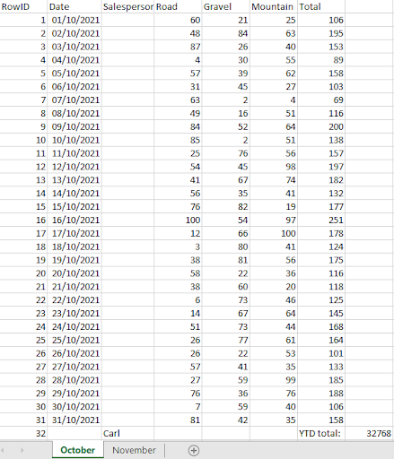
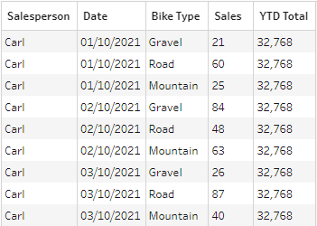
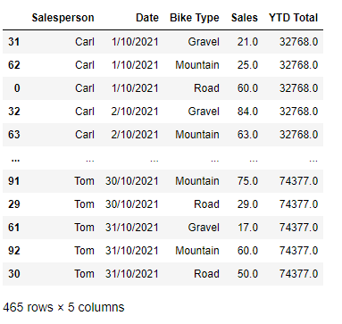

# Description

Super basic description

- Structure dataframe
- Melt

[2021: Week 50 - Departmental December - Sales](https://preppindata.blogspot.com/2021/12/2021-week-50-departmental-december-sales.html)

## Input

## Expected Output

## My Output

I did only one month's solution. Check the CSV.

# My hacky solution

Check the `py` file. I have left comments!

- Used Python to structure the data
- Divided dataframe to salespersons
- Did the stacking in one fell sweep with `df.melt`